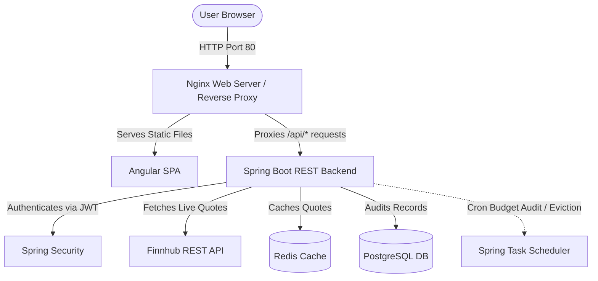
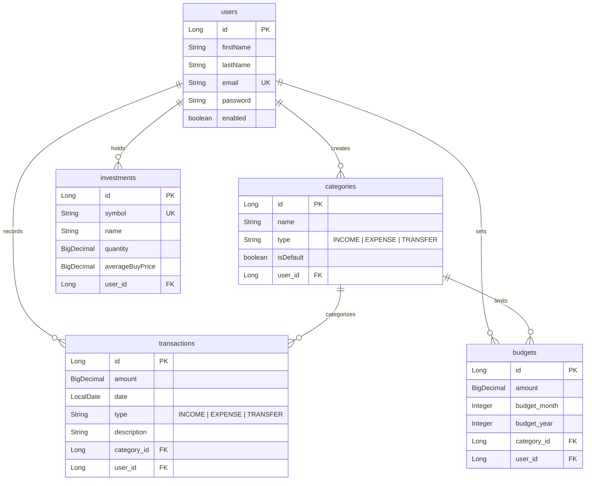

# 📊 WealthWise — Personal Finance & Portfolio Tracker

WealthWise is an enterprise-grade, full-stack personal finance management and investment portfolio tracking application. Engineered with a robust **Spring Boot** backend and a responsive standalone **Angular** frontend, the system facilitates transaction auditing, monthly budgeting limits with warning thresholds, live stock portfolio cost-basis calculations, caching, and scheduled background tasks.

---

## 🛠️ Technology Stack

| Layer | Technologies | Key Capabilities |
| :--- | :--- | :--- |
| **Frontend** | Angular (v18+), HTML5, CSS3, Chart.js | Standalone Components, JWT Interceptors, Route Guards, Dark Mode Glassmorphism |
| **Backend** | Spring Boot, Spring Security, JPA/Hibernate, Spring Doc | RESTful Controllers, Stateless Session JWT Auth, OpenAPI/Swagger Docs, RestClient |
| **Database** | PostgreSQL | Relational Schema Storage, Unique Constraints |
| **Caching** | Redis (Spring Cache) | High-Performance Quote Caching (15m TTL), Local Fallback Support |
| **DevOps** | Docker, Docker Compose, Nginx | Multi-Stage Builds, Reverse Proxy API Gateway |

---

## 🏗️ Architecture & Flow



---

## 🗄️ Database Entity Relationship (ER) Diagram



---

## 🌟 Resume & Engineering Highlights

*   **Weighted Average Cost-Basis Algorithm:** Implemented investment purchase scaling logic inside `InvestmentServiceImpl`. When adding shares, the system automatically recalculates the average buy cost basis using:
    $$\text{New Average Price} = \frac{(\text{Old Quantity} \times \text{Old Avg Price}) + (\text{Added Quantity} \times \text{Purchase Price})}{\text{Old Quantity} + \text{Added Quantity}}$$
*   **Deterministic Fallback Pricing Mechanism:** Configured the `MarketDataService` to query market values from the Finnhub API, with a built-in deterministic fallback price generator based on symbol string hashing. This ensures consistent mock data quotes for test suites and offline local setups.
*   **Resilient Spring Caching:** Integrated `@Cacheable` annotations over the pricing lookup queries, supporting high-speed memory reads with a 15-minute Time-To-Live (TTL) expiration, mitigating external API rate limits.
*   **Dynamic Budget warnings:** Programmed database-level unique constraints preventing multiple budgets per category/month/year. The frontend monitors budget limits and dynamically colors progress bars (Cyan $\rightarrow$ Orange $\rightarrow$ Red) based on threshold consumptions.
*   **Secure CSV Streaming:** Built a transaction data exporter that streams CSV blobs using standard RFC 4180 rules, correctly escaping commas and quotes inside user description fields.
*   **Multi-Stage Docker Containerization:** Engineered optimized, lightweight Docker builds for both Spring Boot and Angular, routing static frontend assets and proxying API endpoints through Nginx.

---

## 📡 REST API Documentation

All protected routes require a `Authorization: Bearer <JWT_TOKEN>` header. Interactive Swagger documents can be accessed at `http://localhost:8080/swagger-ui/index.html`.

### 1. Authentication
*   `POST /api/auth/register` - Create user profile.
*   `POST /api/auth/login` - Authenticate credentials and return JWT token.

### 2. User Profiles
*   `GET /api/users/profile` - Retrieve account metadata.
*   `PUT /api/users/profile` - Edit name properties.
*   `PUT /api/users/change-password` - Update password.
*   `PUT /api/users/deactivate` - Disable account.

### 3. Categories & Bookkeeping
*   `GET /api/categories` - Fetch default + user-custom categories.
*   `POST /api/categories` - Create custom category.
*   `GET /api/transactions` - Filter paginated transactions.
*   `POST /api/transactions` - Record transaction.
*   `PUT /api/transactions/{id}` - Modify transaction.
*   `DELETE /api/transactions/{id}` - Delete transaction.

### 4. Budgets & Portfolios
*   `GET /api/budgets` - Fetch budgets for specific month/year.
*   `POST /api/budgets` - Add budget limit.
*   `GET /api/investments` - View portfolio details.
*   `POST /api/investments` - Buy/Register holding.

### 5. Dashboards & Exports
*   `GET /api/dashboard` - Compile home aggregates.
*   `GET /api/reports/monthly` - Compile monthly analysis.
*   `GET /api/reports/export` - Export transactions as CSV.

---

## 🚀 Getting Started

### Prerequisites
*   Node.js (v20+)
*   Java JDK 21
*   PostgreSQL 16+
*   Redis
*   Docker (Optional)

### Option A: Running Locally (Development Mode)
1.  **Start Database & Cache:** Spin up Postgres on port 5432 and Redis on 6379. Create the `wealthwise` database.
2.  **Run Backend:** Configure `src/main/resources/application.properties` with database credentials, then run:
    ```bash
    ./mvnw spring-boot:run
    ```
3.  **Run Frontend:** Open `frontend` directory, install packages, and serve:
    ```bash
    cd frontend
    npm install
    npm run start
    ```
    Navigate to `http://localhost:4200` in your browser. All API requests are proxied automatically.

### Option B: Running via Docker (Staging Mode)
To run the entire ecosystem (Database + Cache + Backend + Frontend/Nginx) inside containers:
1.  Build and start the compose stack:
    ```bash
    docker-compose up --build
    ```
2.  Navigate to `http://localhost:80` in your browser. Nginx acts as the entry gateway.
